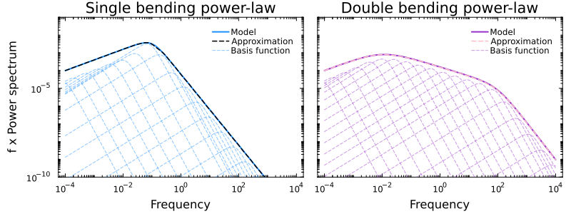

[](#)

[](https://github.com/mlefkir/Pioran.jl/actions/workflows/documentation.yml) [](https://github.com/mlefkir/Pioran.jl/actions/workflows/testbuild.yml)
[](https://codecov.io/gh/mlefkir/Pioran.jl)

Pioran is a Julia package to estimate bending power-law power spectrum of time series. This method uses Gaussian process regression with the fast algorithm of [Foreman-Mackey, et al. 2017](https://ui.adsabs.harvard.edu/abs/2017AJ....154..220F/abstract). The bending power-law model is approximated using basis functions as shown in the Figure below:

[](#)

The method is described in [Lefkir et. al 2025](https://ui.adsabs.harvard.edu/abs/2025MNRAS.539.1775L/abstract).
## Installation

```julia
using Pkg; Pkg.add("Pioran")
```

## Documentation

See the documentation at [https://mlefkir.github.io/Pioran.jl/stable/](https://mlefkir.github.io/Pioran.jl/stable/).

## Examples

Example scripts are provided in the [examples](./examples) directory. To infer the parameters of the power spectrum, I use either [`Turing.jl`](https://github.com/TuringLang/Turing.jl) for Hamiltonian Monte Carlo or the Python library [`ultranest`](https://github.com/JohannesBuchner/UltraNest) for nested sampling. The scripts are written in a way that you can use either of these libraries.


## Citing the method

If this method or code was useful to you, you can cite [Lefkir et. al 2025](https://ui.adsabs.harvard.edu/abs/2025MNRAS.539.1775L/abstract) for method and [Foreman-Mackey, et al. 2017](https://ui.adsabs.harvard.edu/abs/2017AJ....154..220F/abstract) for the celerite algorithm.
