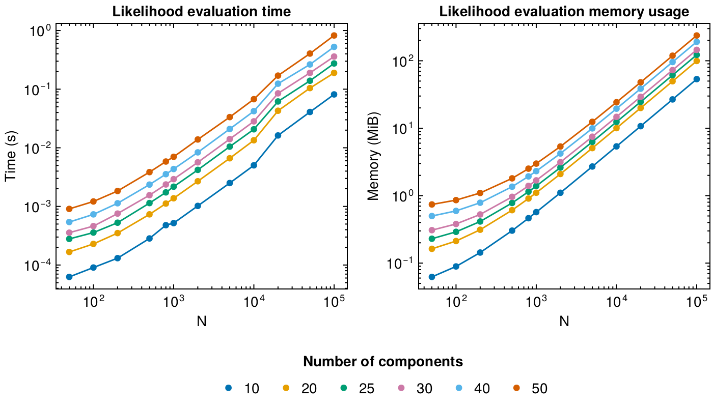

# Spectral analysis in Pioran

Here we only give a brief introduction to Gaussian processes and how we use them in `Pioran` to infer the power spectrum of a random time series. For more details on Gaussian processes, we refer the reader to the book by [2006gpml.book.....R](@citet).

## Gaussian process regression

A Gaussian process $\boldsymbol{f}$ is formally defined as a collection of random variables, any finite number of which have a joint Gaussian distribution. This process is fully described by its mean function $\mu(t)$ and its covariance function (or kernel) $ \mathcal{R}(t,t')$. The kernel must be a positive-definite function, i.e. the covariance matrix $K$ with elements $K_{ij} = \mathcal{R}(t_i, t_j)$ must be positive-definite.

#### Likelihood function

Assuming data $\boldsymbol{x}(t)$ are generated by a Gaussian process $\boldsymbol{f}$ with constant mean $\mu$ and covariance function $ \mathcal{R}(\tau)$, a likelihood function can be derived. The log-likelihood function is given by:

```math
\ln\mathcal{L}(\boldsymbol{\theta},\nu,\mu)=-\frac{1}{2}\left( \boldsymbol{x} - \mu \right)^{\rm T} \left(K +\nu\boldsymbol{\sigma^2} I\right)^{-1} \left( \boldsymbol{x} - \mu \right) -\dfrac{1}{2}\ln\left|K +\nu\boldsymbol{\sigma^2} I\right| - \dfrac{n}{2}\ln(2\pi)
```

where $\boldsymbol{\theta}$ are the parameters of the covariance function, $\nu$ is a scale on the measurement variance, $\mu$ is the mean of the process, $\boldsymbol{\sigma^2}$ is the measurement noise, and $n$ is the number of data points. In practice, Gaussian process regression is computationally expensive! The cost of evaluating this likelihood function scales as $\mathcal{O}(n^3)$ and the cost of storing the covariance matrix in the memory scales as $\mathcal{O}(n^2)$.

#### Conditional Gaussian process

The conditional distribution of the Gaussian process given the data  $\boldsymbol{x}$ and time values $\boldsymbol{t}$, is also a Gaussian process. This new distribution can be used to make predictions at new points $\boldsymbol{t_*}$ and the predictive distribution is given by

```math
\begin{aligned}
\mathbb{E}[\boldsymbol{f_*}| \boldsymbol{t},\boldsymbol{x},\boldsymbol{t_*}] &= K_* \left[K +\boldsymbol{\sigma^2} I \right]^{-1} \boldsymbol{x}.\\
\mathrm{Cov}[\boldsymbol{f_*}| \boldsymbol{t},\boldsymbol{x},\boldsymbol{t_*}] &= K_{**} - K_* \left[K +\boldsymbol{\sigma^2} I \right]^{-1} {K_*}^{\rm T}
\end{aligned}
```

where $K_*$ is the covariance matrix between the new points $\boldsymbol{t_*}$ and the old points $\boldsymbol{t}$, and $K_{**}$ is the covariance matrix between the new points $\boldsymbol{t_*}$. The cost of computing the conditional distribution scales as $\mathcal{O}(n^3)$.

### Covariance functions and power spectral densities

Here we model time series data, i.e. data indexed by time. We will assume a one-dimensional and stationary Gaussian process. In this case, the covariance function $\mathcal{R}(t,t')$ is only a function of the time separation $\tau = t - t'$. The covariance function and the power spectral density are Fourier pairs.

```math
\mathcal{P}(f) = \int_{-\infty}^{+\infty} \mathcal{R}(\tau) e^{-2{\rm i}\pi f \tau} {\rm d }\tau \quad  \quad \mathcal{R}(\tau) = \int_{-\infty}^{+\infty}  \mathcal{P}(f) e^{2{\rm i}\pi f \tau} {\rm d }f
```
If we could compute analytically the covariance function using the inverse Fourier transform of our desired models, we could then use the covariance function to compute the likelihood function and infer the parameters of the power spectral density using Gaussian process regression.
Unfortunately, it is not always easy to compute the covariance function from the power spectral density, for instance the [`SingleBendingPowerLaw`](@ref),[`DoubleBendingPowerLaw`](@ref) model do not have closed form Fourier transforms. One could think of using the Discrete Fourier Transform (DFT) to provide an estimate of the covariance function, however it would also require interpolating the result of the DFT to populate the covariance matrix at any time lags. Additionally, this will not solve the expensive cost of evaluating the likelihood function.

## Gaussian processes in Pioran

In `Pioran.jl`, we use scalable Gaussian processes to model the time series data and infer the parameters of the power spectral densities.
We implement the [`ScalableGP`](@ref) type to build a Gaussian process using the [AbstractGPs](https://github.com/JuliaGaussianProcesses/AbstractGPs.jl) interface.

As presented above, Gaussian process regression is expensive to compute and it is not possible to describe all possible spectral densities with analytical kernels. Here we propose to use an approximation of the power spectral density by a sum of simple power spectral densities called basis functions. We choose these simple power spectral densities to be the Fourier transform of known covariance functions which have a quasi-separable structure. This enables the fast and scalable computation of the log-likelihood function using the `celerite` algorithm introduced in [2017AJ....154..220F](@cite).
Python implementations of the `celerite` algorithm are available in [celerite2](https://celerite2.readthedocs.io/en/latest/) and [tinygp](https://tinygp.readthedocs.io/en/stable/).

This method uses the quasi-separable structure of the covariance functions [`Celerite`](@ref), [`SHO`](@ref) and [`Exp`](@ref) to compute the log-likelihood in a linear scaling with the number of datapoints as shown in the following benchmarks.


